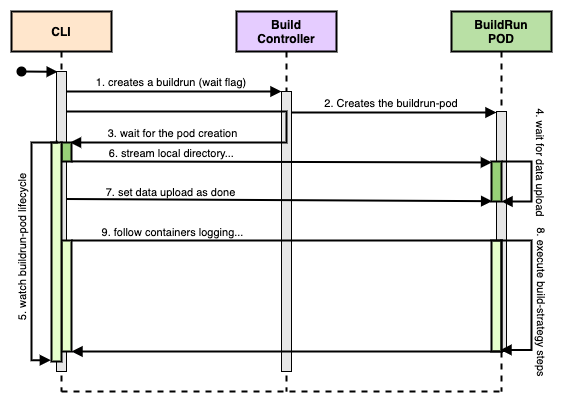

# Source Upload

## Release Signoff Checklist

- [x] Enhancement is `implementable`
- [x] Design details are appropriately documented from clear requirements
- [x] Test plan is defined
- [ ] Graduation criteria for dev preview, tech preview, GA
- [ ] User-facing documentation is created in [docs](/docs/)

## Summary

Proposal to improve developer-experience by allowing to upload a local repository clone to the
Kubernetes cluster, and use Shipwright Build Controller to produce a container-image out of it.

As a developer, I can try Shipwright before opening a pull-request, and take advantage of the cluster
resources to create the image. Effectively moving shipwright closer to the developer's inner-loop, in
other words closer to the frequent activities while writing code ([1][InnerLoopA], [2][InnerLoopB]),
in other words we are "moving left before _shipping-right_".

## Motivation

Shipwright Build-Controller allows teams to build container-images from a series of inputs, such as
source code management systems like Git, then register and track their application builds in a
Kubernetes native environment. This enhancement proposal extends this ability for developers to
upload uncommitted changes and use the same machinery during the inner-loop as well.

A developer can try out changes before opening a pull-request, make sure the final container image
will work out as expected, and effectively improve the developer experience.

The approach proposed here is complementary to existing [EP][LocalSourceCodeEP] detailing local
source upload to a container-registry and later on self-extracting the image before the actual
container build process starts.

### Goals

- Improve developer experience, local clone can produce a container-image using Shipwright machinery
- Move Shipwright CLI closer to developer's inner-loop
- Complementary to [upload-to-container-registry (EP)][LocalSourceCodeEP], uploading data directly to
the cluster instead

## Proposal

This proposal includes changes in Shipwright components, and adds a new helper application to aid
data upload process.

The user-experience using the CLI should be as simple as the following example, assuming the user is
present at the same directory than the source code, and a `Build` named `nodejs-ex` exists.

```bash
shp buildrun upload nodejs-ex --to-cluster
```

Here, a new sub-command, `upload` is introduced and the user may choose `--to-cluster` or
`--to-registry` options, to respectively, upload to the cluster directly or upload to
container-registry.

### Sequence Diagram

The following sequence-diagram shows the relationship between the components and explains the order
of execution. In a nutshell, the CLI creates a `BuildRun` object, with settings to wait for data
upload, which can only start when the Build-Controller instructs Kubernetes to create this new pod.
The new pod, on the other hand, needs to be running and ready to receive external data.

With the data upload complete, the build-pod can continue to execute the build-strategy chosen,
producing a container-image at the end.



To explain the sequence of events in more detail, please consider the following topics.

#### Prepare _(Step 1 to 3)_

The preparation consists on declaring a `BuildRun` object _(1)_ with configuration for the
Build-Controller, to instead of appending the regular "`git clone`" step at runtime, it will block
(_wait_ ) the execution of the strategy steps until the user input is available in the pod _(2)_. The
waiting process will have a configurable timeout.

On the CLI, it will be watching for the creation of pods using a `LabelSelector` _(3)_,  which
narrows the search criteria to only find the pod triggered by step 1. Namely, the selector label is
currently `buildrun.shipwright.io/name` which carries on the original `BuildRun` name.

The objective here is to watch the exact POD which corresponds to the `BuildRun` triggered by the
CLI, in order to upload local contents and build.

#### Upload _(Step 4 to 7)_

Shipwright-Controller sets up a Tekton Workspace named "source", and therefore the build-pod
containers have a `/workspace/source` volume mounted, this volume will receive the uploaded data. The
build-pod waits _(4)_ for the upload by keeping the entrypoint process active until the end of the
upload.

The CLI knows in which state _(5)_ the build-pod is at, since the data upload can only happen when
the build-pod is running. Given the right conditions, it streams the local data to the cluster _(6)_.

Once the streaming is finished, the CLI notifies the waiting process the upload is done _(7)_, so
inside the build-pod the execution of subsequent containers can take place.

#### Build _(Step 8 and 9)_

When the build steps are being executed _(8)_ in the build-pod, the developer will have the execution
logs being shown in the command-line _(9)_. The developer can interactively watch the container build
execution and possible errors that might surface.

At the end, when the build-pod is completed successfully _(5)_, the CLI shows the meta information
about the container image built, and instructions on how to pull and use the image.

#### Watching the Build-POD

As mentioned before, Shipwright builds are based on a sequence of containers being executed on a
single pod, the CLI needs to watch _(5)_ over the state changes, and react as soon as it happens. For
example, the build-pod can be deleted, fail immediately, fail during execution, and such. Moreover,
as we can observe on the sequence diagram, it also needs to wait for specific conditions before
streaming data.

During research and development, this requirement was translated into a [watch][ClientGoWatch]
instantiated on the build-pod, and a straightforward mechanism to create an event-loop around pod
[state changes][EventLoopExample].  Each change of state will trigger the call of the informed
closures, and allows wiring [events and reactions in a practical manner][EventLoopUsage].

### Upload Mechanism

This EP describes the direct data streaming to the Kubernetes cluster, directly to the POD running
the actual build process, while we already have plans to support data upload towards a
[container-registry][LocalSourceCodeEP] alternatively.

#### Redirecting Standard Input

The data upload mechanism is the same employed on <code>[kubectl cp][KubectlCP]</code>, which is
redirecting the standard-input (<code>STDIN</code>) from the client to the container, inside the
desired pod.

Analogous to `kubectl cp`, we will be using `tar` to stream data from the client, while
<code>[kubectl exec][KubectlExec]</code> on the pod keeps a <code>tar</code> process waiting for
data on <code>STDIN</code>.

#### Shipwright Build Controller

The Shipwright Build Controller works based on [Tekton Workspaces][TektonWorkspaces], and therefore,
it already defines the `/workspace/source` mount point for all containers in the build-pod.
Shipwright Build Controller also adds it's own helper to ["git clone" the
repository][ControllerGitClone] in place.

With that said, we can simply stop Shipwright Build-Controller from issuing the "`git clone`", and
instead, add a [simple helper application][ControllerWaiter] that's able to hold the build-pod
execution while the data is transferred.

To accomplish this the Build-Controller needs to be able to detect it should replace the "`git
clone`" procedure by waiting for the upload helper instead. The changes done during research and
development are [here][ControllerWaiterUsage].

##### BuildRun Changes

In the `BuildRun` resource, the Build Controller will inspect for the following annotations:

- `buildrun.shipwright.io/upload.type`: configures the mechanism data is uploaded, as in `direct` or
`bundle-image`. Initially only `direct`, described on this EP, will be available;
- `buildrun.shipwright.io/upload.wait`: boolean attribute, only `true` or `false` accepted;
- `buildrun.shipwright.io/upload.wait.timeout`: sets the timeout;

The idea is to employ annotations as we would employ flags in a command-line application, they inform
the Build Controller about the desired changes for that particular `BuildRun` instance.

```yml
---
apiVersion: shipwright.io/v1alpha1
kind: BuildRun
metadata:
  annotations:
    buildrun.shipwright.io/upload.type: "direct"
    buildrun.shipwright.io/upload.wait: "true"
    buildrun.shipwright.io/upload.wait.timeout: "30s"
spec: {}
```

Therefore when `buildrun.shipwright.io/wait.upload` is present the waiting will take place, and by
expressing `buildrun.shipwright.io/upload.wait.timeout` the actual timeout is configured.

Only the `BuildRun` object will accept the "flags" to trigger the waiting for user upload, meaning
this type of approach is not meant to leak towards the parent `Build` resource.

##### Statically Typed BuildRun API (Optional)

The `sources` slice is part of [Remote Artifacts (EP)][RemoteArtifactsEP] and has been worked on, so
more effort may be needed to create a good API fit. The alternative API is:

```yml
---
apiVersion: shipwright.io/v1alpha1
kind: BuildRun
metadata: {}
spec:
  sources:
    - name: src
      type: LocalCopy
      timeout: 30s
```

As a alternative to use annotations described before, a new source type `LocalCopy` will be
introduced. This new type is located on `.spec.sources` slice, and triggers the same behavior, with
the advantage having *statically typed* fields, and can be easily spotted inside the `.spec`.

Additionally, the `timeout` attribute sets how long the `waiter` will wait for the user input.

#### Waiting Mechanism

The container-image built by Shipwright is created by a series of steps running sequentially, those
steps are executed in the build-pod, running each container and inspecting for return-code and
errors.

The task at hand, waiting for the users' data transfer, will follow the same basic structure, which
means a simple application meant to wait for a specific condition, and exit gracefully afterwards.
Here we may keep checking if a given "lock" file exists, when removed the application exists. It also
must exit with an error on timeout.

Additionally, we can employ this application to make verifications on the streamed data, like for
instance checksum, ownership (UID/GID) and more.

The implementation written for research and development can be found at [otaviof/waiter][Waiter]
repository, and it is started by running "`waiter start`". When running it will keep watching the
file `/var/tmp/waiter.pid`, and when removed, it will exit gracefully. The following example shows it
running in the container-manager. In the following example the entrypoint receives the argument
"`start`", and the waiting begins.

```sh
$ docker run --name=waiter --interactive otaviof/waiter:latest start
2021/06/01 08:25:24 Saving PID '1' at '/var/tmp/waiter.pid'
2021/06/01 08:25:24 Attempts '600'...
2021/06/01 08:25:25 Attempts '599'...
2021/06/01 08:25:26 Attempts '598'...
2021/06/01 08:25:27 Done!
```

When the data transfer is complete, the CLI will execute "`waiter done`", via the same "`kubectl
exec`" mechanism.

```sh
$ docker exec waiter waiter done
2021/06/01 08:25:56 Removing pid-file '/var/tmp/waiter.pid' (1)
```

This procedure works on the current version of [Tekton (v0.22.0)][TektonV0220] used in Shipwright
Build-Controller.

##### Waiter on Controller Repository

The `waiter` application will live on the [Build Controller repository][ControllerCmd], side by side
with other applications, and producing a stand alone container-image. The image must be based on
UBI8, following the same standards than others.

This image also has `tar` installed, which will be used for the data upload mechanism, as explained
before.

Another requirement is following the same configuration standard than other external images used by
the Build Controller, like a environment variable (i.e.: `GIT_CONTAINER_TEMPLATE`) to overwrite the
image before the controller starts.

At last, it should provide meaningful information for Tekton's `TaskResult`, so we can differentiate
this step run from others. For the `waiter` process results, it can take advantage of the
[termination-log pattern][KubernetesTerminationLog] to inform Tekton more detailed execution results.

### User Stories

#### Developer's Inner-Loop

As a software developer, before submitting my code changes to my source code management system (like
Git), I want to capture the code changes in a container image built by the same Shipwright Build
Controller and using cluster's computing power.

As a software developer, I want to be able to build container images based on source code residing in
my personal work environment without needing to install container manager, like for instance Docker,
in my personal work environment to be able to build new images.

#### Continuous-Integration

As as user or maintainer of a CI system, I would like to be able to employ the building of container
images from a local repository clone for various test scenarios further down in the CI pipeline. And
in doing so, I would like to no require the installation of container managers like Docker to build
those container images.

Additionally, it would also avoid the need for a container manager (like Docker) to build container
images during pipelines, so it also simplifies the process of testing applications.

### Test Plan

Testing this feature can be achieved by unit-testing on each component. The CLI can simulate the
works of the Build Controller, as in simululate how the Kubernetes API will respond upon each
situation.

The Build Controller will also simulate Kubernetes API during the unit-testing, and for end-to-end
testing we will perform data upload, as the CLI does, in order to have the testing complete.

### Risks and Mitigations

In a nutshell, this enhancement-proposal will use `exec` to run `tar` on the waiter container, and
stream the data via standard-input, the data lies in a `EmptyDir` volume.

#### Abuse of `exec`

Via the CLI users should only be able to execute the `tar` command inside, so Waiter's base-image
must be rid of additional tooling. Additionally, waiter should run as non-privileged container, with
a non-root user.

#### Excessive Amounts of Data

Users could potentially upload more data than the node running the actual build is able to support.
Here we need to make sure the CLI only uploads intersting bits, like for instance ignoring the
entries on `.gitignore` (and maybe other types of ignore-files), plus we can enhance the Waiter to
check how much data has been uploaded and enforce limits.

## Drawbacks

None.

## Alternatives

This enhancement-proposal describes an alternative upload mechanism than the
[upload-to-registry][LocalSourceCodeEP], and an alternative method to wait for data transfer.

## Prior-Art

### OpenShift Classic Build

Classic [Builds in OpenShift][OpenShiftDocBuilds] provides several means of uploading local content
to the cluster, and building container-images out of it. The sub-command start-build
(`oc start-build`) provides `--from-dir`, `--from-file`, `--from-archive` and `--from-repo` options
to allow users to use a local directory, file or tarball archive as build inputs, respectively.

### Azure Draft

Microsoft released an experimental tool, [Azure Draft][AzureDraft]. The idea is to stream a local
"docker context" from a local machine to the cluster, and use the Kubernetes' node Docker instance to
build the container image.

The user experience is very close to what this enhancement-proposal describes, but the primary focus
was Helm, and therefore Draft used to bring the container-image build as means to actively develop a
chart.

[AzureDraft]: https://github.com/azure/draft
[ClientGoWatch]: https://pkg.go.dev/k8s.io/client-go/tools/watch
[ControllerCmd]: https://github.com/shipwright-io/build/tree/main/cmd
[ControllerGitClone]: https://github.com/shipwright-io/build/blob/5136c594b1adc5924bd063d0d6f4d5b264d6b99b/pkg/reconciler/buildrun/resources/taskrun.go#L137-L138
[ControllerWaiterUsage]: https://github.com/otaviof/build/blob/8d951a71c542dcae619f84c2b0d7bd77e3877f38/pkg/reconciler/buildrun/resources/taskrun.go#L137-L146
[ControllerWaiter]: https://github.com/otaviof/build/blob/8d951a71c542dcae619f84c2b0d7bd77e3877f38/pkg/reconciler/buildrun/resources/sources_upload.go#L17-L29
[EventLoopExample]: https://github.com/shipwright-io/cli/blob/6b5d007c1050df6abf1421275b995b6da4a4edbe/pkg/shp/reactor/pod_watcher.go#L57-L108
[EventLoopUsage]: https://github.com/otaviof/cli/blob/b70442b9b44a3d3b41a33d3841a99c1ecced85e9/pkg/shp/cmd/buildrun/upload.go#L198-L226
[InnerLoopA]: https://www.openshift.com/blog/openshift-4-2-expanded-tools-and-services-for-developers
[InnerLoopB]: https://developers.redhat.com/blog/2020/06/16/enterprise-kubernetes-development-with-odo-the-cli-tool-for-developers
[KubectlCP]: https://github.com/kubernetes/kubectl/blob/a216b5f2e7291f3495a1ad3f6c8e029885dee232/pkg/cmd/cp/cp.go#L241-L293
[KubectlExec]: https://github.com/kubernetes/kubectl/blob/a216b5f2e7291f3495a1ad3f6c8e029885dee232/pkg/cmd/cp/cp.go#L278-L292
[KubernetesTerminationLog]: https://kubernetes.io/docs/tasks/debug-application-cluster/debug-application-introspection
[LocalSourceCodeEP]: https://github.com/shipwright-io/build/blob/main/docs/proposals/enable-local-source-code-support.md
[OpenShiftDocBuilds]: https://docs.openshift.com/container-platform/4.7/cicd/builds/basic-build-operations.html#builds-basic-start-source_basic-build-operations
[RemoteArtifactsEP]: https://github.com/shipwright-io/build/blob/main/docs/proposals/remote-artifacts.md
[TektonV0220]: https://github.com/tektoncd/pipeline/releases/tag/v0.22.0
[TektonWorkspaces]: https://github.com/tektoncd/pipeline/blob/main/docs/workspaces.md
[Waiter]: https://github.com/otaviof/waiter
