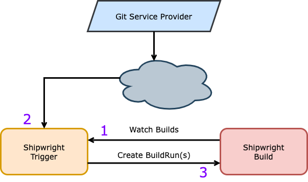
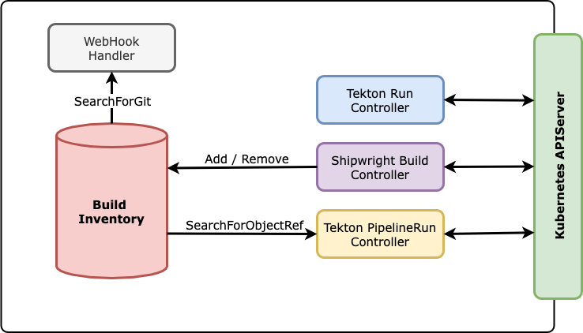

Shipwright Trigger
------------------

# Summary

Shipwright's project goal is to automate and greatly simplify the container image building process, and currently, users can only initiate the build process by issuing a new `BuildRun` object.

This enhancement proposal describes how Shipwright will react to:
- WebHooks: Handles WebHook requests from Git service providers, like GitHub, in order to activate a Build 
-  Tekton Pipelines: Integration between Tekton Pipelines and Shipwright, Builds will be triggered when a given Pipeline has reach the desired status
- Tekton [Custom-Tasks][tektonCustomTasksTEP] (Run): A new Custom Task will allow users to call out Shipwright Builds directly from Pipelines
- Images: Integration with the new Shipwright [Image project][shipwrightImage], changes to any Images managed by that project that serve as input into a Shipwright Build will initiate new BuildRuns when any of those images change.

# Motivation

An essential part of the developer experience is to be able to commit and push code changes, while rest assured that will actionate automation procedures to produce a new container image.

As well as, being able to combine the image creation process with Continuous Integration pipelines, and watch over Tekton Pipelines which may be producing dependencies and other artifacts used on container images built by Shipwright.

Thus, the primary motivation for this enhancement proposal is to improve developer experience using Shipwright, by providing a good level of integration with Git service providers, Tekton Pipelines and the [Image controller][shipwrightImage].

## Goals

- Improve developer experience
- Allow integration of Git service providers via WebHook
- Incorporate into Tekton Pipelines via Custom-Tasks
- integration with Tekton Pipelines, being able to react upon Pipeline executions
- Integration with Image controller, being able to react upon container image changes

## Non-Goals

- General Git service providers WebHook support (only GitHub supported initially)
- Modify `.spec.output` directives

# Proposal

Introduce a new project name Shipwright Trigger (`shipwright-io/trigger`) to based on the rules defined on the Build resources, listen to WebHook events coming from Git service providers, incorporate Shipwright into Tekton via `CustomTask` (Tekton Run resource), and watch over Tekton Pipeline resources in order to trigger `BuildRun` resources accordingly.

## API Changes

We will modify the `Build` CRD to allow users to define how to trigger it. The API will look like the following:

```yml
---
apiVersion: shipwright.io/v1alpha1
kind: Build
spec:
  source:
    url: https://github.com/otaviof/nodejs-ex.git
    credentials:
      name: webhook-secret
  trigger:
    when:
      - name: for push and pull-request on the main branch
        type: GitHub
        github:
          events: 
            - Push
            - PullRequest
          branches:
            - main
      - name: watching for the base-image changes
        type: Image
        image:
          names:
            - ghcr.io/some/base-image:latest
      - name: when a Tekton Pipeline is "Succeeded"
        type: Pipeline
        objectRef:
          status:
            - Succeeded
          selector:
            label: value
```

The trigger is defined directly on the `Build` resource, and when the attribute is empty it means the given `Build` resource is not subject to triggers, as expected. The new `.spec.trigger` attribute is structured as follows:

- **`.source.credentials.name`**: local reference to a Secret object, containing pre-defined keys to share an [secret-token][githubWebHookSecretToken] between Git service providers and local `Build` instances, reusing the exiting Secret for the Git repository authentication
- **`.when[]`**: slice of scenarios to describe *when* the `Build` will be activated
- **`.when[].name`**: short description of what the scenario entails
- **`.when[].type`**: the type of trigger, as in: `GitHub`, `Image` and `Pipeline`
- **`.when[].github`**: attribute for `GitHub` type
- **`.when[].github.events[]`**: GitHub WebHook events supported, initially `Push` and `PullRequest`
- **`.when[].github.branches[]`**: slice of branch names where a Build will be activated in case of WebHook event. When not informed, it will adopt the attribute `.spec.source.revision` value instead
- **`.when[].objectRef`**: used in conjunction with `Pipeline`(type), and describes a local Tekton Pipeline instance and its current status;
- **`.when[].objectRef.name`**: when informed, the Pipeline is directly search by its name;
- **`.when[].objectRef.status[]`**: slice of Tekton Pipeline [status names][tektonPipelineRunStatus] where a new Build should be activated. For instance *"Succeeded"*;
- **`.when[].objectRef.selector{}`**: a map of label key-value entries, a alternative to the `.objectRef.name` attribute, the Tekton Pipeline resource will be identified by label matching;

On the table below, you can see the relationship between the source of the event and the type (`.when[].type`), described on the `Build` resource. Please consider:

| Event Source                | Types    | Description                          |
|-----------------------------|----------|--------------------------------------|
| Git Service Provider        | GitHub   | WebHook events for GitHub            |
| Shipwright Image Controller | Image    | Watching Image objects and reacting  |
| Tekton Pipeline Controller  | Pipeline | Watching Tekton objects and reacting |

All the modifications needed are on the `Build` resource under `.spec.trigger` attribute, making this new feature backwards compatible with `v1alpha1`.

## WebHook Events

The following image represents the actors involved in the WebHook request workflow, and shows the order on which the actors are actionated:



The start of the workflow (1) is at the Shipwright Trigger instance, it will be watching over `Build` objects using a regular Kubernetes Controller. Since the Trigger Controller is aware of all `Build` instances, it creates an inventory of `Builds` carrying trigger rules (`.spec.trigger` attribute), and therefore, it's able to search for `Build` objects. The Trigger will only start listening for WebHook requests when the controller has synchronized, so it has the inventory full beforehand.

The WebHook request (2) carries on information about the repository, so Shipwright Trigger can filter out the `Build` objects representing that specific repository, and by inspecting the event details determine if it should create a `BuildRun` object. 

For instance, consider the following snippet of a GitHub Push event:


```json
{
    "ref": "refs/heads/main",
    "before": "before-commit-id",
    "repository": {
   	 "full_name": "organization/repository",
   	 "html_url": "https://github.com/organization/repository"
    },
    "head_commit": {
   	 "message": "commit message",
   	 "author": {
   		 "name": "Author's Name"
   	 },
   	 "id": "commit-id",
   	 "timestamp": "2022-02-18T11:02:02.635313+01:00"
    }
}
```

Note the snippet attribute `.repository.htm_url` can be compared to Build's `.spec.source.url` in order to determine which `Build` objects are affected by the event. Likewise, we can employ `.ref` to determine which branch is affected, and later asseting if it's part of the Build `.spec.trigger.when[].github.branches` entries.

Depending on the event type, it will need to inspect `.head_commit.id` as well, so in other words, the events offer more than enough information to fulfill the needs of triggering Shipwright Builds (3).

### Git Service Providers Support

Shipwright Trigger will initially ship with [GitHub support][githubGoGithub], users will be able to configure the WebHook endpoint with additional [secret-token verification][githubWebHookSecretToken], in order to trigger Shipwright Builds accordingly.

The GitHub support is based on a common interface, on which we will support more service providers in the near future, like for instance GitLab and others. Therefore, the interface semantics must be able to implement the following use cases:

- Parse the WebHook request payload identifying the specific type of event
- Extract the inputs needed to be able to select the Build instances
- Validate the payload against a secret-token shared between the service provider and the user

With that said, the [initial interface suggestion][triggerWebHookInterface] is as follows:


```go
// Interface describe the signature expected for the instances handling WebHook
// requests, coming from Git service providers.
type Interface interface {
    // ExtractRequestPayload parse and extract the request details, is service 
    // provider specific.
    ExtractRequestPayload(*http.Request) (*RequestPayload, error)

    // ExtractBuildSelector extract the search parameters to select the Build 
    // objects related to the WebHook request payload.
    ExtractBuildSelector(*RequestPayload) (*BuildSelector, error)

    // ValidateSignature verifies the request payload against the informed
    // secret token.
    ValidateSignature(*RequestPayload, []byte) error
}
```

Internally, we will differentiate the service provider based on the [pattern][pkgGoHTTPHandle], the request URL path, and therefore we can allow users to configure which pattern will respond for a given Git service provider requests.

### Security Model

The security model is enforced by only allowing the Shipwright Trigger to have the [least amount of permissions as possible][triggerDeployRole]. The new application will have to watch over Shipwright Build, BuildRun, Tekton PipelineRun and Run.

In other words, we will effectively limit the scope of the Kubernetes objects the service account is permitted to access, making sure it can only interact with the Shipwright and Tekton components plus the `Secret` for WebHook validation. The `Secret` must be only loaded during the verification step, and thus secrets are read on the fly and garbage collected right after, making sure the application only has access to the Secrets listed on the `Build` objects temporarily.

Another perspective of the security model is imposed by creating a component meant to handle external input, as in input coming from the open internet, and therefore we need to make sure the best practices are in place. As in, validating the events, checking event signature and checksum.

It's important to point the users to official documentation records explaining the best practices of exposing a service to the internet, both using Kubernetes Ingress Controller and OpenShift Routes. In the recommendations, we must point out documentation on how to add TLS communication for the endpoints in a Kubernetes cluster, plus mentioning advanced scenarios like service-mesh based clusters.

## Tekton Pipelines Integration

This enhancement proposal describes how Tekton Pipelines utilize Shipwright resources, and additionally, how Shipwright Build can watch over Pipelines.

Shipwright Build Controller itself is based on Tekton Pipelines, it leverages `TaskRun` objects generated to accomplish the container image creation, based on the chosen `BuildStrategy` and parameters. So, it's also logical to extend the Tekton Pipelines support in order to promote Shipwright to be used in combination.

### Tekton Custom Task

The Tekton community has been working on the [Custom Tasks proposal (TEP-0002)][tektonCustomTasksTEP] as an interface to expand Tekton scope out of its own resources, and therefore it's able to activate Shipwright Builds as part of a regular Tekton Pipeline.

The mechanics is everytime Tekton Pipeline finds an external resource, it creates a [Run object][tektonDocsPipelines] with the coordinates specified in the `Pipeline`, thus controllers watching over `Run` resources will have the ability to react accordingly.

A example of Tekton Pipeline using Shipwright Build is the following:

```yaml
---
apiVersion: tekton.dev/v1alpha1
kind: Pipeline
spec:
  tasks:
    - name: shipwright
      params:
        - name: platform-api-version
          value: "0.4"
      taskRef:
        apiVersion: shipwright.io/v1alpha1
        kind: Build
        name: nodejs-ex
```

And, from the Shipwright Trigger perspective, it will need to watch over the `Run` objects that are referencing Shipwright resources, and actionate them accordingly. In the example above it will create a `BuildRun` for the *"nodejs-ex"* Build.

Whenever a new Run object is created the Shipwright Trigger will inspect and create a `BuildRun` object accordingly. In the case of having parameters (`.spec.tasks[0].params` in the example above), those brought to the `BuildRun` object as [Shipwright Build Parameters][shipwrightBuildParamValues]. In the example, the `Pipeline` sets `platform-api-version` parameter, which defines the Buildpacks [supported API version][shipwrightBuildpacksAPIVersion].

The status updates are constantly reflected from the `BuildRun` into the parent Tekton `Run` resource, making sure Tekton Pipelines is constantly informed about the progress. The whole workflow is captured on the [RunController business logic][triggerControllersRunController] ([and here too][imjasonhBuildTaskMain]).

### Tekton Pipelines

Let's zoom in on an example of triggering the Shipwright Build when a Tekton Pipeline named "nodejs-ex" has succeeded. For instance:

```yaml
---
apiVersion: shipwright.io/v1alpha1
kind: Build
spec:
  trigger:
    when:
      - name: nodejs-ex pipeline has succeeded
        type: Pipeline
        objectRef:
          name: nodejs-ex
          status:
            - Succeeded
```

This gives Shipwright the ability to build a container image when the continuous-integration pipeline has ended, like for instance building an image after the tests have finished. Another example is watching over dependencies and other automation processes running on Tekton.

The API also supports using selector labels to match Tekton Pipelines as well, giving a broader scope to select Pipelines to trigger Builds.

To accomplish this task, Shipwright Trigger must watch over PipelineRun objects, and check if there are Builds in the inventory that should be activated. The business logic is recorded on the [PipelineRun Controller][triggerControllersPipelineRunController].

## Trigger Actors

This section explains what are the actions inside the Shipwright Trigger application, and how they interact with each other and with Kubernetes as well. Please consider the following image:



In the next sections each actor is detailed.

### Build Inventory

The [inventory is the central component][triggerInventoryInventory] of Shipwright Trigger, it stores all the Build instances organized in a way that allows searching for types of triggers, depending on the Inventory client.

For example, the WebHook Handler will always search for Builds based on the Git repository URL, the event (`Push` or `PullRequest`), and the branch names. In other hand, the other Controllers will query the inventory based on the `.objectRef` attribute instead.

As you can see on the diagram above, almost all components are interacting with the Inventory using the specialized query methods `SearchForGit` and `SearchForObjectRef`.

#### Shipwright Build Controller

The Builds are added or removed from the Inventory through the [Build Controller][triggerControllersBuildController], responsible to reflect all Shipwright Build resources into the Inventory. On adding new entries, the Build is prepared for the subsequent queries.

### Tekton Run Controller

Watches for [Tekton Run instances][triggerControllersRunController] referencing Shipwright Builds, when a new instance is created it creates a new `BuildRun`. The controller also watches over the `BuildRun` instance, in order to reflect the status back to the Tekton Run parent.

The Tekton Run instances are part of the Custom Task workflow, everytime Tekton finds a `TaskRef` resource outside of Tekton's scope, it creates a `Run` instance with the coordinates. In other words, to extend Tekton's functionality third party applications must watch and interact with those objects.

### Tekton PipelineRun Controller

The [controller for PipelineRun instances][triggerControllersPipelineRunController] is meant to react when a Pipeline reaches the desired status, so upon changes on the resource the controller checks on the inventory if there are triggers configured for the specific resource in question, in the desired status.

Upon the creation of a `BuildRun` instance, the `PipelineRun` object is labeled for the controller to be able to avoid reprocessing.

### WebHook Handler

The [WebHook handler][triggerWebHookHTTPHandler] is a simple HTTP server implementation which receives requests from the outside, and after processing the event, searches over Builds that should be activated. The search on the inventory happens in the same fashion as the controllers, however uses `SearchForGit` method.

This type of `SearchForGit` is meant to match the repository URL, the type of event and the branches affected. For instance, the WebHook event can have different types, like `Push` or `PullRequest` and plus the branch affected.

## Trigger Cause

Whenever a `BuildRun` is issued by the Shipwright Triggers, it must register all the relevant attributes that caused it. The relevant attributes must be able to identify the which trigger inside the `.spec.trigger.when[]` slice, plus the context obtained from the WebHook request and from the Kubernetes resources watched.

Those relevant attributes will be codified as `BuildRun` annotations, following a predetermined structure on which the Build Controller is able to make use of. The Build Controller, the owner of `Build` and `BuildRun` resources, will then translate the information from the annotations to properly structured status fields.

For instance, imagine the following `BuildRun` instance created by Shipwright Trigger, containing the following labels:

```yaml
---
apiVersion: shipwright.io/v1alpha1
kind: BuildRun
metadata:
  annotations:
    trigger.shipwright.io/trigger-when-name: for push directly on the main branch
    trigger.shipwright.io/trigger-when-type: GitHub
    trigger.shipwright.io/trigger-when-github-events: Push
    trigger.shipwright.io/trigger-when-github-branches: Push
```

Where the `BuildRun` labels above is based on the following attributs:

```yaml
---
apiVersion: shipwright.io/v1alpha1
kind: Build
spec:
  trigger:
    when:
      - name: for push directly on the main branch
        type: GitHub
        github:
          events:
            - Push
          branches:
            - main
```

Alternatively, the information could use JSON as the transport mechanism, instead of organizing the information as flat key-value pairs.

The trigger cause must be part of a status condition showing the exact reason and relevant contextual information, thus all relevant attributes of the `.spec.trigger.when` entry which triggered the `BuildRun` must be informed, as well information obtained from the WebHook request and as well from Kubernetes resources.

## Test Plan

In order to assert all the traits of the Shipwright Trigger are working, we will write end-to-end tests using Ginkgo, following the steps of the Build Controller. The components should be deployed against a KinD (Kubernetes in Docker) instance, following the same steps of the CLI repository, on which we can roll out the Build Controller and its dependencies independently.

The WebHook events are easily reproducible in the CI environment, therefore we can load the event types from Golang based repositories and fire against Trigger's WebHook endpoint. It should produce `BuildRun` objects accordingly, those are picked up by the Build Controller and actualized into pods.

## Risks and Mitigations

### How to avoid exposing cluster's resources?

All the communication with the external parties, like GitHub, is made via the HTTP WebHook, thus we need to make sure there is no cluster resource information exposed on the response payload.

### How to avoid unwanted WebHook requests?

To avoid unwanted WebHook requests we will validate those using the shared secret, informed on the service provider during the WebHook initial configuration. Following this approach we can make sure only the entities that carry the shared secret can invoke the WebHook.

Additionally, we must document the good practices to expose internal services, where the cluster administrators may decide to enhance the security mechanisms, like for instance using a service mesh.

# Drawbacks

None.

# Alternatives

## Tekton Triggers

An alternative design to handle WebHook requests is using [Tekton Triggers][tektonTriggersGH]. The workflow starts by defining a `ClusterTriggerBinding`, which describes the exact bits of the WebHook request payload that will be extracted, and those are used as parameters for the `TriggerTemplate` resource.

The `TriggerTemplate` defines the template of the resource to be created based on the parameters, this resource must be Tekton's, and so, in order to reach Shipwright it must instantiate a `Run` object, with the coordinates. Then, an `EventListener` instance takes place to reference the template and the `ClusterTriggerBinding`.

Finally, from the Shipwright side we need to capture the Run resources, and trigger `BuildRun` objects accordingly, this mechanism is named [Custom-Tasks in Tekton][tektonCustomTasksTEP].

As you can see, this path is an indirect approach to handle WebHook requests, by leveraging the Tekton building blocks, a very useful way to create Kubernetes based automation

However, for Shipwright purposes, the indirectness creates a challenge for the user experience. As in, the ability to differentiate "Push" and "Pull Requests", and also, to be able to return not-found (404) in the case there are no `Build` instances for the Git repository. In other words, would be difficult to sustain this model for subsequent Shipwright features related to triggers.

[tektonCustomTasksTEP]: https://github.com/tektoncd/community/blob/main/teps/0002-custom-tasks.md
[shipwrightImage]: https://github.com/shipwright-io/image
[githubWebHookSecretToken]: https://docs.github.com/en/developers/webhooks-and-events/webhooks/securing-your-webhooks#setting-your-secret-token
[tektonPipelineRunStatus]: https://tekton.dev/docs/pipelines/pipelineruns/#monitoring-execution-status
[githubGoGithub]: https://github.com/google/go-github
[triggerWebHookInterface]: https://github.com/otaviof/shipwright-trigger/blob/main/pkg/trigger/webhooks/interface.go
[tektonDocsPipelines]: https://tekton.dev/docs/pipelines/runs/
[shipwrightBuildParamValues]: https://github.com/shipwright-io/build/blob/main/docs/build.md#defining-paramvalues
[triggerControllersRunController]: https://github.com/otaviof/shipwright-trigger/blob/main/pkg/trigger/controllers/run_controller.go
[triggerControllersBuildController]: https://github.com/otaviof/shipwright-trigger/blob/main/pkg/trigger/controllers/build_controller.go
[triggerInventoryInventory]: https://github.com/otaviof/shipwright-trigger/blob/main/pkg/trigger/inventory/inventory.go
[triggerControllersPipelineRunController]: https://github.com/otaviof/shipwright-trigger/blob/main/pkg/trigger/controllers/pipelinerun_controller.go
[triggerWebHookHTTPHandler]: https://github.com/otaviof/shipwright-trigger/blob/main/pkg/trigger/webhooks/http_handler.go
[imjasonhBuildTaskMain]: https://github.com/imjasonh/build-task/blob/main/cmd/controller/main.go
[triggerDeployRole]: https://github.com/otaviof/shipwright-trigger/blob/main/deploy/200-role.yaml
[pkgGoHTTPHandle]: https://pkg.go.dev/net/http#Handle
[shipwrightBuildpacksAPIVersion]: https://github.com/shipwright-io/build/blob/c5e815bdbb60181e30934f3819229effcc9c100a/samples/buildstrategy/buildpacks-v3/buildstrategy_buildpacks-v3_cr.yaml
[tektonTriggersGH]: https://github.com/tektoncd/triggers