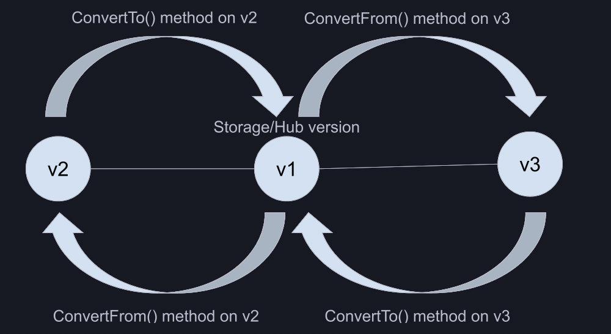

<!--
Copyright The Shipwright Contributors

SPDX-License-Identifier: Apache-2.0
-->

---
title: Shipwright BETA API Release
authors:
  - "@qu1queee"
reviewers:
  - "@SaschaSchwarze0"
  - "@adambkaplan"
approvers:
  - "@SaschaSchwarze0"
  - "@adambkaplan"
creation-date: 2022-07-09
last-updated: 2023-03-10
status: implementable
---

# Shipwright BETA API Release

## Release Signoff Checklist

- [x] Enhancement is `implementable`
- [x] Design details are appropriately documented from clear requirements
- [x] Test plan is defined
- [x] Graduation criteria for dev preview, tech preview, GA
- [ ] User-facing documentation is created in [docs](/docs/)

## Open Questions [optional]

## Summary

Propose a path to release Shipwright Beta API. Achieving a Beta API will provide users a more stable version they can depend on, with the certainty of not dropping features. In this document we provide the modifications, deprecations or additions to the Beta API.

## Motivation

1. The majority of the Shipwright Alpha API did not change over time. Part of the current Alpha API is considered mature enough for graduating to Beta.

2. The Shipwright API got many novel ideas over time, supporting different use cases. These features were implemented as part of the Alpha API, but the desired state was not reached. Planning for Beta API puts into triage these features and their potential deprecation.

3. The Shipwright API was created with some assumptions in mind, over time new features force us to rethink on better states of the API.

### Goals

1. Layout the changes for Beta API.

2. Document the deprecation policy for Beta API.

3. Define supported use cases for Beta API.

4. Document migration strategies of API conventions or object definitions from Alpha to Beta.

## Proposal

This proposal introduces a Beta API for Shipwright, with version `v1beta1` following the Kubernetes API [versioning scheme](https://kubernetes.io/docs/reference/using-api/#api-versioning). The current API (`v1alpha1`) will be deprecated and eventually removed.

We will define the `v1alpha1` API version as the stored version in the next releases(_v0.12.0_). One release after(_v0.14.0_) we will switch the stored version to `v1beta1`.

### Deprecation Policy

In the spirit of the Kubernetes Deprecation [policies](https://kubernetes.io/docs/reference/using-api/deprecation-policy/), the beta API will come with the following support guarantees:

1. _No breaking changes, such as removal of fields, will be introduced without introducing a new beta API version (ex - `v1beta2`)._
2. _Beta API versions may be deprecated, however they will continue to be served and supported for a period of 9 months after the deprecation is announced._
3. _The beta API will never be deprecated in favor of an `alpha` API (ex - `v1alpha2`)._
4. _Minimum API lifetime is determined by the API stability level_

Related to 4), in this document we propose that for Beta API versions, we provide coverage after deprecation for **9** months. We do not encourage to be based on releases quantity, per the faster cadence we have compared to Kubernetes.

### API Changes

1. In all resources, introduce a convention for objects with an array, where each element contains the `name` key. An existing example is `.spec.volumes`.
2. In the `Build` resource, replace `.spec.source.credentials` and `.spec.output.credentials` with a single field(_key_). This will become `.spec.source.cloneSecret` and `.spec.output.pushSecret` and will reference a secret name in the current namespace.
3. In the `BuildStrategy` resource(_namespace and cluster scope_), replace `.spec.buildSteps` in favor of `steps`. The same applies to the `BuildStep` Go type.
4. In the `BuildStrategy` resource(_namespace and cluster scope_), replace the `.spec.buildSteps[]` items with a custom type, instead of the whole `corev1.Container` Go type.
5. In the `Build` resource, replace the `build.build.dev/build-run-deletion` annotation in favor of `.spec.retention.atBuildDeletion`.
6. In the `BuildRun` resource, rename `.status.latestTaskRunRef` to `.status.taskRunName`.
7. In the `BuildRun` resource, consolidate `.spec.buildRef.name` and `.spec.buildSpec` into `.spec.build.name` and `.spec.build.spec`.
8. Use `type discriminators` if an API object has some form of implied polymorphism. For example, source types or volume sources.

### Deprecation

1. In the `Build` resource, deprecate `.spec.sources`. We only allow `.spec.source`.
2. In the `Build` resource, deprecate `.spec.dockerfile`.
3. In the `Build` resource, deprecate `.spec.builder`.
4. In the `Build` resource, deprecate `.spec.volumes[].description`.
5. In the `Build`, `BuildStrategy` and `ClusterBuildStrategy` resource, remove the `status` subresource.
6. In the `BuildRun` resource, remove the support for auto-generating a service account.

### Supported Use Cases

#### Story 1

As a user, I can create a Shipwright _v1beta1_ custom resource. Shipwright should be able to convert this into a _v1alpha1_ custom resource and stored that version.

#### Story 2

As an external Kubernetes controller, I should be able to operate on Shipwright _v1beta1_ or _v1alpha1_ CRD's, independently of the API stored version.

### Implementation Details/Notes/Constraints [optional]

We rely on the controller-runtime conversion model known as "hub and spoke". In this model, we will mark one version as the "hub", and all other versions just define conversion to and from the hub. In the scenario of needing to convert between two non-hub versions, we first convert to the hub version, and from there to the desired version:

For requests to a particular version that is not the API stored version in ETCD, we will require a webhook. The webhook will be called by the API server to do the conversion. For the webhook, we will rely on the [webhook](https://pkg.go.dev/sigs.k8s.io/controller-runtime/pkg/webhook/conversion) package from controller-runtime. The [conversion](https://pkg.go.dev/sigs.k8s.io/controller-runtime/pkg/conversion) package will provide us the interface definitions that an API type must implement to be supported by the generic conversion webhook from controller-runtime.

From the above, the implementation can be categorize in two areas:

#### Webhook Implementation

1. We need to implement a webhook, following the [webhook](https://pkg.go.dev/sigs.k8s.io/controller-runtime/pkg/webhook/conversion) controller-runtime package. This webhook should assume that the related API types implement the conversion interface definitions.

#### API types and conversion functions

1. Decide on the storage version. Here we propose to make _v1alpha1_ the storage version. This makes the _v1alpha1_ the "hub".
2. Add the _v1beta1_ API types, under [apis/build](https://github.com/shipwright-io/build/tree/main/pkg/apis/build)
3. Introduce `<resource_name>_conversion.go` files next to the types, here we will define functions for conversion. This applies to all API versions.
4. For the hub, we will introduce under the `*_conversion.go` file a `Hub()` function. This will be done for the _v1alpha1_ API version.
5. For the spokes, we introduce under the `*_conversion.go` a `ConvertTo()` and `ConvertFrom()` function. This will be done for the _v1beta1_ API version.
6. Populate the conversion functions, to adhere to the API changes and deprecations mentioned above.
6. Modify the CRDs, to explicitly state which API version must be stored and which not.
7. Regenerate all artifacts, from generated code to CRDs based on the new API types.
8. Ensure that helper scripts for autogenerating are aware of the _v1beta1_ type.

Note: We do not need to modify shipwright business logic or test cases, as they currently use the _v1alpha1_ API version. However, once the _hub_ API version is modified, we will need to modify this accordingly.

### Risks and Mitigations

None. Users should be able to use both API versions without any inconvenience.

## Design Details

### Test Plan

- Not required. We do not modify for the time being any test case.
- We need implement unit-tests to the `*_conversion.go`.

### Graduation Criteria

This will be part of the Shipwright/Build v0.12.0 release-

### Upgrade / Downgrade Strategy

Not applicable.

## Implementation History

Not applicable.

