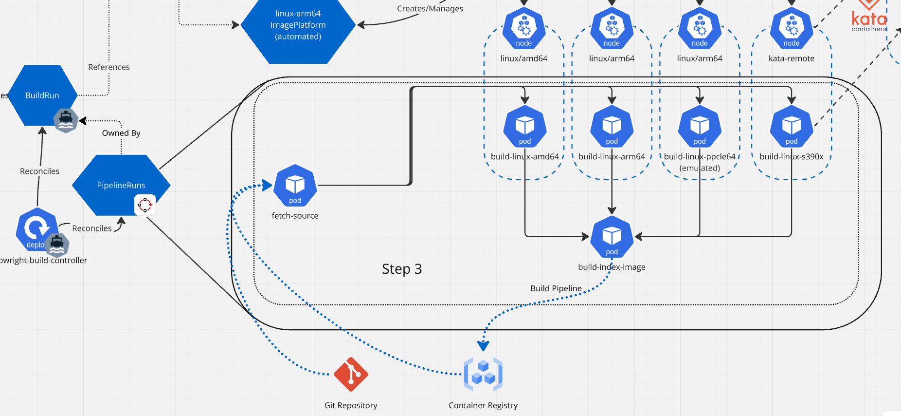

<!--
Copyright The Shipwright Contributors

SPDX-License-Identifier: Apache-2.0
-->

---
title: multi-arch-image-builds
authors:
  - "@adambkaplan"
reviewers:
  - TBD
approvers:
  - TBD
creation-date: 2025-05-21
last-updated: 2025-05-21
status: implementable
see-also:
  - "ships/0039-build-scheduler-opts.md"  
  - "https://github.com/shipwright-io/community/pull/263"
replaces: []
superseded-by: []
---

# SHIP-0043: Multi-arch Image Builds

## Release Signoff Checklist

- [x] Enhancement is `implementable`
- [x] Design details are appropriately documented from clear requirements
- [x] Test plan is defined
- [ ] Graduation criteria for dev preview, tech preview, GA
- [ ] User-facing documentation is created in [docs](/docs/)

## Open Questions [optional]

TBD

## Summary

This extends Shipwright to orchestrate multi architecture container image builds based on settings
provided by platform engineers/cluster administrators. It aims to solve the following challenges
related to building multi-arch container images:

* Scheduling builds on native Kubernetes nodes for a given os + architecture.  
* Scheduling builds for a given os + architecture using Kata peer pods.  
* Providing a parameter to tools that support multi-arch builds through emulation or
  cross-compilation.

## Motivation

### Background

#### OCI Image Indexes

The Open Container Initiative (OCI) provides the industry standards for container image
specifications and formats. It is the successor to Docker’s “v2” specification for container
images, and is designed to be backwards compatible. The specification includes an
[“image index” standard](https://github.com/opencontainers/image-spec/blob/main/image-index.md#image-index-property-descriptions)
for containers that can be run on multiple CPU and operating system architectures. This is
equivalent to the Docker v2 “manifest list,” and the two terms are used interchangeably. For
consistency in this proposal, “image index” will be used moving forward.

#### Multi-arch Worker Nodes

Many Kubernetes distributions - starting with v1.30 and perhaps earlier - allow clusters to have
worker nodes with different OS and CPU architectures. Clusters expose the node OS and CPU
architecture through [default node labels](https://kubernetes.io/docs/reference/node/node-labels/).
Shipwright began accomodating these scenarios with
[SHIP-0039](https://github.com/shipwright-io/community/blob/main/ships/0039-build-scheduler-opts.md),
whose features were incrementally released in Builds v0.14 and v0.15. However, these features only
let developers create single images for a single architecture. Creating an image index for multiple
architectures requires significant orchestration effort outside of Shipwright.

#### Multi-Arch Capabilities in Build Toolchains

Many popular container build tools, such as `buildkit`, `buildah`,
[cloud native buildpacks](https://buildpacks.io/docs/for-app-developers/how-to/special-cases/build-for-arm/),
and `ko` support multi-arch builds through cross-compilation or qemu-style CPU emulation. These
tools often expose a `--platform` command line option to build the image with a different os +
architecture than the underlying host. The industry appears to have standardized on the `<GOOS>/<GOARCH>`
naming conventions for “platform” (ex: `linux/amd64`). These are identical to the namings used for
Kubernetes node labels.

Support for generating an OCI image index varies by tool. Some - like ko and buildah - do provide
support for creating image indexes. These typically require the build to run in the same process;
“fan out” support to run these builds in parallel is typically not supported or is more challenging
to set up in a containerized environment (ex: `podman farm` command).

### Goals

* Provide a mechanism for developers to request a multi-arch image build, or build for a specific
  OS + CPU architecture.
* Provide a mechanism for system administrators to control how multi-arch builds execute.

### Non-Goals

* Generalized matrix builds for Shipwright. This is a capability provided by Tekton.
* Adding retries for failed builds. This is out of scope to simplify the design. Such a feature can
  be considered in a follow-up enhancement.
* Scheduling builds on nodes with specialized hardware (ex: GPUs). This is already supported in
  Shipwright through the scheduler options in v0.15.
* Management of container resources (CPU, memory) at the Build/BuildRun level. At present, these
  can only be defined at the ClusterBuildStrategy/BuildStrategy level. See
  [build#1894](https://github.com/shipwright-io/build/issues/1894).

## Proposal

### User Stories

- As a developer, I want to build containers for x86 and ARM so I can share my app with my team
  using different CPU architectures (Apple Silicon vs. Windows x86)
- As a cluster admin, I want multi-arch builds to be scheduled on native nodes if my Kubernetes
  cluster has multiple CPU architecture worker nodes.
- As a platform engineer, I want to provide a standard way for my teams to run multi-arch container
  builds.

### Implementation Notes

#### “Image Platform” Concept

An image platform is the combination of operating system (“os”), CPU architecture (“arch”), and
other container image “platform” attributes as defined in the OCI [Image Index specification](https://github.com/opencontainers/image-spec/blob/main/image-index.md#image-index-property-descriptions).
Developers can specify the desired platform(s) for a container image build as a JSON/YAML object
with the following attributes:

- `os`: operating system. Required
- `arch`: CPU architecture. Required

The JSON/YAML representation is intended to future-proof the API for additional “features” defined
in the OCI image index spec, or other items that Shipwright can support at a later date (ex: cpu
arch variant, os.version).

A shorter single-string format for “platform” is not allowed within the Kubernetes YAML. However,
it can be supported when invoked from the command line (see below).

#### `ImagePlatform` CRD

Shipwright will introduce a new custom resource definition, `ImagePlatform`, which instructs
Shipwright how a container image could be built for a specific operating system and CPU
architecture (“image platform”). These instances are cluster-scoped, and more than one can be
defined for a given image platform.

Each ImagePlatform object defines the following:

- `platform`: the platform object, as defined above. Required.
- `nodeSelector`: standard map of Kubernetes node selectors. Optional.
- `runtimeClass`: object with single field, name. Corresponds to a Kubernetes RuntimeClass.
  Optional.
- `tolerations`: object with Shipwright’s implementation of the Tolerations API. This is an
  intentional subset of the Kubernetes Tolerations API, optimized for finite build workloads. See
  [SHIP-0039](https://github.com/shipwright-io/community/blob/main/ships/0039-build-scheduler-opts.md#tolerations)
  for more information.
- `paramValues`: object containing a list of Shipwright parameters as named key/value pairs. Optional.

At least one of `nodeSelector`, `runtimeClass`, `tolerations`, and `paramValues` must be set. More
than one of these can be used in combination. Below are example ImagePlatform objects:

```yaml
# Select linux/amd64 nodes and tolerate the "pipeline-node" taint
apiVersion: shipwright.io/v1alpha1
kind: ImagePlatform
metadata:
  name: linux-amd64-native
spec:
  platform:
    arch: amd64
    os: linux
  nodeSelector:
    kubernetes.io/os: linux
    kubernetes.io/arch: amd64
  tolerations:
    - key: "konflux-ci.dev/pipeline-node"
      operator: Exists
```

```yaml
# Use the "kata-remote" RuntimeClass to build linux/s390x images
apiVersion: shipwright.io/v1alpha1
kind: ImagePlatform
metadata:
  name: linux-s390x-kata-remote
spec:
  platform:
    arch: s390x
    os: linux
  runtimeClass:
    name: kata-remote
```

```yaml
# Inject the `SHP_BUILD_PLATFORM` parameter into all builds for linux/ppcle64
apiVersion: shipwright.io/v1alpha1
kind: ImagePlatform
metadata:
  name: linux-ppcle64-emulated
spec:
  platform:
    arch: ppcle64
    os: linux
  paramValues:
    - name: SHP_BUILD_PLATFORM
      value: "linux/ppcle64"
```

#### `ImagePlatformClass` CRD

Paired with the `ImagePlatform` CRD above is another new custom resource, `ImagePlatformClass`.
This CRD instructs Shipwright how a multi-arch image build should be orchestrated using the
referenced `ImagePlatform` objects. This API serves a similar function as the `StorageClass` or
`RuntimeClass` APIs in Kubernetes, and is likewise cluster-scoped.

The CRD consists of the following fields:

- `imagePlatforms`: an array of references to the supported `ImagePlatform` objects. This array is
  represented in two ways:
  - In `spec`, this is a reference to the respective object by name.
  - In `status`, this references the object by name and reports the OS + cpu architecture. A
    controller is responsible for populating this information and keeping it up to date.
- `status.conditions`: standard Kubernetes conditions. The `Available` condition type will always
  be reported, indicating that the `ImagePlatformClass` object is properly configured. This status
  can be set to `False` if the referenced `ImagePlatform` objects represent the same OS + CPU
  architecture.

Below is a sample CRD instance that builds Linux images for x86, ARM, Power, and Z architectures:

```yaml
apiVersion: shipwright.io/v1alpha1
kind: ImagePlatformClass
metadata:
  name: all
spec:
  imagePlatforms:
    - name: linux-amd64-native
    - name: linux-arm64-konflux
    - name: linux-s390x-emulated
    - name: linux-ppcle64-remote
status:
  conditions:
  - type: Available
    status: True
    reason: "All image platforms available."
    lastTransitionTime: <timestamp>
  imagePlatforms:
    - name: linux-amd64-native
      arch: amd64
      os: linux
    - name: linux-arm64-konflux
      arch: arm64
      os: linux
    - name: linux-s390x-emulated
      arch: s390x
      os: linux
    - name: linux-ppcle64-remote
      arch: ppcle64
      os: linux
```

`ImagePlatform` and `ImagePlatformClass` objects will default to only allow creation/edit by full
cluster admins. Read access (get and list) may be considered for users with the “edit” and “admin”
user-facing roles. The Shipwright build controllers will need “get”, “list”, and “watch”
permissions on these resources (the latter to enable caching).

#### Multi-arch in `Build` and `BuildRun` objects

The `Build` and `BuildRun` APIs will add a new `multiArch` JSON/YAML object to `spec.output`. This
object will contain the following fields:

- `platforms`: list platforms to build, using the above "image platform" structure. Required.
- `imagePlatformClass`:- string that identifies the “Platform Class” used to orchestrate the multi-
   arch build. Required.

Below is an example multi-arch Linux image build for x86, ARM, Power, and Z:

```yaml
apiVersion: shipwright.io/v1beta1
kind: Build
spec:
  ...
  output:
    image: <url>
    multiArch:
      imagePlatformClass: all
      platforms:
        - arch: amd64
          os: linux
        - arch: s390x
          os: linux
        - arch: arm64
          os: linux
        - arch: ppcle64
          os: linux
```

#### `BuildRun` Controller Reconciliation

##### Validations

The build controller will add additional validation checks for the new `spec.output.multiArch` API
prior to starting the build. These checks should not be invoked if `spec.output.multiArch` is empty
- existing logic to reconcile a `BuildRun` should proceed.

First, the `BuildRun` controller will validate that the referenced `ImagePlatformClass` object
exists and has the `Available=True` status. If this object does not exist on the cluster, or does
not have `Available=True` status, the `BuildRun` should be marked as failed with reasonable status
conditions. No Tekton objects should be created in this situation.

Next, the controller should validate that the referenced `ImagePlatformClass` supports the listed
platforms in the referenced `Build` (or in the `BuildRun` directly). If the `ImagePlatformClass`
does not support all platforms in the build, the build should be marked as failed with reasonable
status conditions. Likewise, no Tekton objects should be created.

Finally, the controller should check that the `ImagePlatform` settings do not collide with other
settings in the Build/BuildRun, as follows:

- Node selector keys for the `ImagePlatform` shall not collide with the `spec.nodeSelector` keys.
- Tolerations for the `ImagePlatform` shall not collide with the `spec.tolerations` keys.
- Names in the `paramValues` for the `ImagePlatform` shall not collide with `spec.paramValues` names.

If a collision is found, the build should be marked as failed with reasonable status conditions,
and no Tekton objects should be created.

##### Tekton `PipelineRun` Generation

If all checks above pass, the `BuildRun` controller will then generate a Tekton `PipelineRun` to
execute the build. This will require significant refactoring of the existing codebase, which
currently generates a single `TaskRun` that is effectively “single-threaded.”



The containers in the generated `PipelineRun` will be executed in three phases:

**Phase 1: Obtain Source**

The first phase will gather the source code. The mechanism for the generated `TaskRun` will vary
depending on the values in spec.source for the Build/BuildRun.

Code from git will invoke the current Shipwright git clone process as a TaskRun with the following
containers:

- The main “git clone” container that exists today.
- A second “image push” container, leveraging the existing Shipwright container that supports
  “managed push”. This container will package the source code into an OCI artifact, which is then
  pushed to the same registry as the output image. A tag suffix pattern (-src) will be used to
  ensure the source code artifact is persisted on most image registries. This may require
  significant enhancements to the current “image push” container.

Code from “local source” will likewise invoke a TaskRun as above to receive source code from a
remote machine. It will push the source code to an OCI artifact, as above.

Code from an OCI artifact will not invoke any TaskRun during this phase. The push of source code to
the image registry has already been completed.

**Phase 2: Fan Out Builds**

The generated `PipelineRun` will then define a set of Tekton `TaskRuns` that can be run in parallel
- one for each platform in `spec.output.multiArch.platforms`. Each `TaskRun` will set appropriate
attributes (`nodeSelector`, `runtimeClass`, or `paramValue`) per the specification in the build’s
referenced `ImagePlatform`. The TaskRun containers will do the following:

- Pull the source code from the referenced OCI artifact. This will utilize existing Shipwright
  logic for pulling source code from OCI artifacts.
- Inject any paramValues specified in the `ImagePlatform`.
- Execute the build per the referenced build strategy.
- Push the output container image to the image registry, with the `-<os>-<arch>` tag suffix.
- Publish the output container image digest as a `TaskRun` result value.

All other fields used to control the build pod definition - such as resources and volumes - will be
inherited from the parent Build/BuildRun object as they are today.

**Phase 3: Assemble Index Image**

The last phase of the generated `PipelineRun` will create a `TaskRun` that assembles the OCI image
index, based on the results of the prior build `TaskRuns`.

If any platform failed to build, the PipelineRun should fail and subsequently mark the BuildRun as
failed.

#### CLI Enhancements

The CLI will add the `--platform-class` and `--platform` flags to the Build and BuildRun oriented
commands. These shall set the respective values for `spec.output.multiArch`. The `--platform`
option can be set multiple times, and will accept platforms in their single-line `<os>/<arch>`
format.

Example experience:

```sh
shp build create sample-go --strategy=source-to-image --output quay.io/adambkaplan/sample-go:v1 \
  --platform=linux/amd64 --platform=linux/arm64 --platform-class default

shp build run sample-go --platform-class default --platform linux/amd64 --platform linux/arm64 \
  --platform linux/s390x
```

### Test Plan

Existing test infrastructure can be used to verify a combination of "native" builds on x86 Linux
nodes and emulated builds using an injected build parameter. The community _may_ adopt a convention
for injecting the "platform" value across the sample build strategies that support cross-
compilation or CPU emulation (ko, buildah, buildkit, and perhaps others.).

Unit and integration tests will likewise need to be extended to ensure the generated `PipelineRun`
for multi-arch builds works as expected, and that existing `TaskRuns` for typical builds do not
break.

### Release Criteria

#### Removing a deprecated feature [if necessary]

N/A

#### Upgrade Strategy [if necessary]

The new CRDs will be added upon upgrade - either by installing in a release manifest or through the
operator.

The new multiArch field in `Build` and `BuildRun` objects will be optional (fields within it will
be required). Current builds should work as expected.

### Risks and Mitigations

TBD

> What are the risks of this proposal and how do we mitigate? Think broadly. For example, consider
> both security and how this will impact the larger Shipwright ecosystem.

> How will security be reviewed and by whom? How will UX be reviewed and by whom?

## Drawbacks

### Verbose API for “Platform”

Developers are used to a single string representation of “platform” - ex “linux/amd64”. This is
provided through the command line, but not in the YAML.

Using a verbose API in the YAML allows us to future-proof builds with more complex manifest list
definitions. The OCI image index spec already has fields that are allowed to be defined on image
index entries which are excluded from this initial API for the sake of simplicity:

- `variant` - some (but not all?) build tools support this. Ex: podman, buildah
- `os.version` - use is not really observed in the field today.
- `features` - this is a catch-all for future extensions to the oci image spec. This might be
  relevant for AI workloads if a container image requires specific hardware to execute.

### Decoupled ImagePlatform Parameters

Parameters in Shipwright are loosely coupled to the Build Strategy that utilizes them. Platform
teams + Shipwright maintainers define the build strategies available to developers, who then
reference these build strategies directly in their builds. Developers can specify parameter values
in the `Build` or `BuildRun` object instances. 

Parameters in `ImagePlatform` add another layer of loose coupling. In order for an `ImagePlatform`
parameter to work, its name and value need to be understood by the strategy referenced in the
build. Cluster admins/platform engineering teams may need to pair their curated
`ClusterBuildStrategies` with `ImagePlatforms` to support multi-arch builds. To verify this feature
works, the Shipwright community could adopt a convention for the "platform" instruction in the
community-maintained samples. Ex: use the parameter name `SHP_IMAGE_PLATFORM`.

### ImagePlatformClass Collisions

Node selector keys/values, toleration key/values, and parameter key/values can collide with values
set elsewhere in the Build/BuildRun. Failing the build when a collision is detected may be our best
option here, since it is hard decipher user intent in this situation.

### Reconcile Needed for ImagePlatformClass

`ImagePlatform` has a many-many relationship with `ImagePlatformClass`: an `ImagePlatform` can be
referenced by 0 or more `ImagePlatformClass` objects, and an `ImagePlatformClass` can reference 1
or more `ImagePlatform` objects. A controller must ensure that the `ImagePlatformClass` does not
reference the same OS + CPU architecture more than once. Reconciling such a relationship may prove
cumbersome.


## Alternatives

### String Shorthand for “Platform” in YAML

Many developers who do multi-arch builds with Podman or Buildkit are familiar with a single string
representation of “platform”. While convenient, this adds additional complexity to the storage and
serialization of data in Kubernetes. The shorthand also locks the API to a convention that may not
be universally understood by all build tools.

Using the shorthand in the CLI provides this capability in spirit, and closer to where developers
directly interact with builds.

### Only add `ImagePlatformClass` API

The `ImagePlatform` API could be absorbed into the `ImagePlatformClass` object, which would
eliminate the need for an `ImagePlatformClass` controller. A validating webhook or CEL expression
could ensure that the set of image platforms do not overlap/collide.

Separating the `ImagePlatform` object out can make it easier for cluster admins/platform teams to
operate multi-arch build systems. For example, if a certain CPU architecture is not available due
to a cloud provider outage, platform teams can switch builds for the affected architecture to use
emulation easily.

### Tekton Matrix Builds

Tekton has support for matrixed tasks, and work is underway to improve this feature to support
node selectors and other pod template features. In theory the matrix can be used to run Shipwright
builds per architecture, especially if we release the Triggers project which provides a "Shipwright
build in Tekton pipeline" capability.

Our mission is to provide a simplified, opinionated experience for building container images.
Multi-arch is a clear use case specific to container image builds. Tekton deliberately provides
general-purpose solutions that emphasize flexibility. Using the matrix tasks feature exposes
developers to significant amounts of complexity.

## Infrastructure Needed [optional]

None.

## Implementation History

- 2025-05-21: Created as `implementable`
