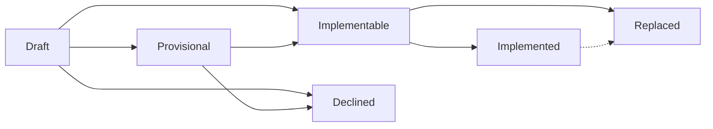

<!--
Copyright The Shipwright Contributors

SPDX-License-Identifier: Apache-2.0
-->

# Shipwright Improvement Proposals (SHIPs)

A Shipwright Improvement Proposal (SHIP) is a way to propose, communicate, and coordinate on new efforts for Shipwright.

## Quick start

1. Socialize an idea with others. Make sure others think the work is worth doing, and are willing to review design and code changes required.
2. Draft a proposal by copying the [proposal template](/ships/guidelines/ship-template.md) into this directory.
   Name your SHIP with the file name pattern `ship-NNNN-tile-name-here.md`, incrementing to the next number in the sequenced of merged proposals.
3. Submit a pull request with your proposal.

## SHIP Lifecycle

### 0. Draft

SHIPs start their lifecycle as a pull request, copying the proposal template. They graduate to the 
_provisional_ or _implementable_ phase when the pull request is merged.

### 1. Provisional

SHIPs that reach this phase focus on the _why_:

- The objective is to agree that an idea addresses a need for the community.
- The summary, motivation, and goals should be clearly articulated.
- Drawbacks and alternatives may not need to be identified at this phase, though the community may
  ask that these be included during review.
- Merging a SHIP as provisional does not imply that the community will implement a feature within
  any reasonable timeframe.

### 2. Implementable

SHIPs that reach this phase focus on the _how_:

- The proposal needs to provide details on how the feature will be implemented and any new APIs
  that are introduced.
- The proposal must also highlight the risks, drawbacks, and alternatives considered for this feature.
- Test and release plans do not need to be fully articulated, though the community may suggest ways
  to test or release the feature at this stage.

Implementable proposals indicate that the community agrees to a feature and related code can be
merged. Once an implementable proposal is accepted, Shipwright project maintainers should do the
following:

- Create a "feature tracker" GitHub issue in the `community` repository, documenting the desired
  functionality and providing links to the relevant SHIP proposal. Feature trackers should link to
  sub-issues that target tasks in specific code repositories. See [community#282](https://github.com/shipwright-io/community/issues/282)
  for an example feature tracker.
- Add the feature tracker to the project [Roadmap], which communicates that this
  approved is approved and seeking contributions.

### 3. Implemented

Implemented SHIPs that reach this phase focus on _what_ and _when_:

- All code and documentation related to the feature should be merged.
- All contributions should be linked to specific releases thorough associated GitHub issues and
  pull requests.
- Implemented proposals should have test and release plans identified.

At this point the propsosal is considered "done." Related feature trackers should be closed in
GitHub and the feature should be marked "done" on the [Roadmap]. Completed features can be removed
frm the [Roadmap] at the discretion of project maintainers.

### Other Lifecycle Phases

* **Declined**: Used if the community decides to not implement a feature at any phase of its
  lifecycle (outside of `implemented`). `implementable` proposals with code contributions should
  not move to the `declined` state.
* **Replaced**: Used if a subsequent proposal is used to implement the same set of functionality,
  or is used to deprecate and remove this feature.

## FAQs

**Do I have to use the process?**

If the enhancement has broad scope, yes.
As a general rule, features that cross multiple components or introduce new APIs should have an enhancement prposal.
It helps everyone track why, when, how, and by whom work is done.

**Why would I want to use the process?**

Provide a mechanism to communicate design and implementation strategies across the Shipwright community.

**Do I need to fill out the entire template?**

You do not have to complete every section of the proposal template - different sections serve different purposes in the SHIP lifecycle.

**My FAQ isn't answered here!**

Open an issue and ask or even better open a PR with a question and proposed answer.

[Roadmap]: ./../ROADMAP.md
